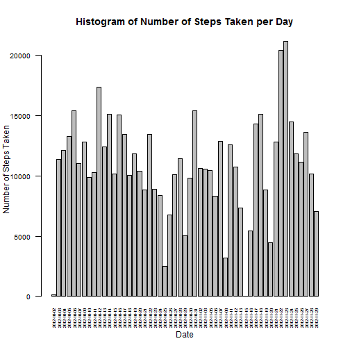
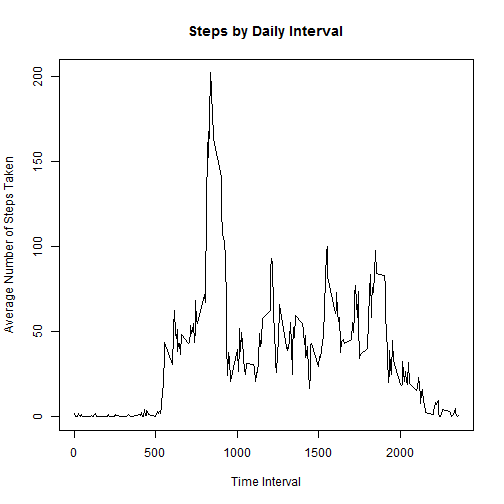
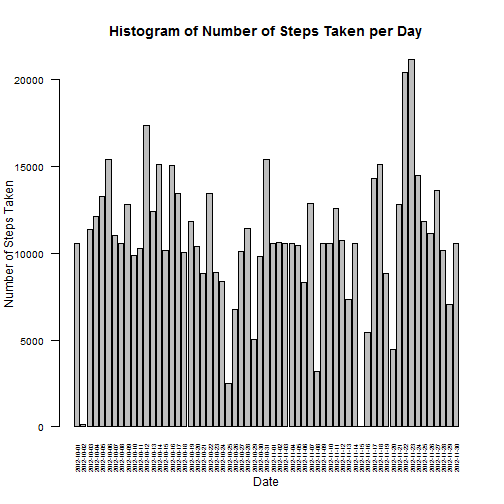
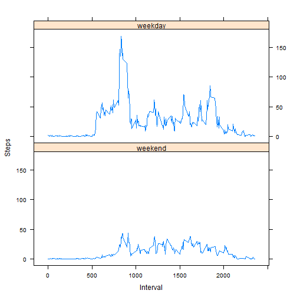

#Part 1: Loading and Pre-processing the Data
First we need to read in the data. This assumes the file has been downloaded and extracted to the working directory. The data will then be processed to remove NA values.


```r
activity <- read.csv(file="activity.csv")
cleanActivity <- na.omit(activity)
```

#Part 2: What is the Mean Total Number of Steps Taken per Day?
We want the mean number of steps taken in a day, so we will use the cleanActivity data set which has NAs removed. Let's use the aggregate() function to get at the sums for each day:


```r
stepSum <- aggregate(steps~date, cleanActivity, sum)
with(stepSum, barplot(steps, names.arg=as.character(date), ylab="Number of Steps Taken", xlab="Date", 
                      main="Histogram of Number of Steps Taken per Day", las=2, cex.names=0.5, cex.axis=0.8))
```



```r
stepMean <- format(mean(stepSum$steps), digits=7)
stepMedian <- median(stepSum$steps)
```

The mean steps per day is 10766.19 and the median steps per day is 10765.

#Part 3: What is the Average Daily Activity Pattern?

We will use the cleanActivity data set again. This time, we will use the aggregate() function to sum the steps by interval, then add a new column on that divides by 54 days (the total number of days in the data set *without NAs*) to get average daily values for each interval. To do this we will use mutate() from the dplyr package. 


```r
if("dplyr" %in% rownames(installed.packages()) == FALSE) {install.packages("dplyr")}
library(dplyr)
intervalSum <- aggregate(steps~interval, cleanActivity, sum)
intervalSumAve <- mutate(intervalSum, aveSteps=steps/54)
stepMax <- format(max(intervalSumAve$aveSteps), digits =5)
intervalMax <- intervalSumAve[intervalSumAve$aveSteps == max(intervalSumAve$aveSteps),1]
with(intervalSumAve, plot(interval, aveSteps, ylab="Average Number of Steps Taken", xlab="Time Interval", 
                       main="Steps by Daily Interval", type="l"))
```



The interval with the highest number of average steps per day is interval 835 with 202.35 steps.

#Part 4: Imputing Missing Values

Now let's figure out a way to deal with the pesky NA values in the original set. First, let's find out where the NAs are.


```r
sum(is.na(activity$steps))
```

```
## [1] 2304
```

```r
sum(is.na(activity$date))
```

```
## [1] 0
```

```r
sum(is.na(activity$interval))
```

```
## [1] 0
```

Okay, so they are all in the "steps" column. Since we calculated the average daily values for each interval in Part 3, let's use those values to replace the missing NA values. We will accomplish this by setting up a **for** loop which runs through the data and identifies where NAs are, then replaces them with the appropriate average step value from the intervalSumAve data set. Then, let's remake the plot from Part 2 with the new data.


```r
i <- 1
rows <- nrow(activity)
for(i in 1:rows) {
  if(is.na(activity$steps[i])==TRUE) {
    NAinterval <- activity$interval[i]
    activity$steps[i] = intervalSumAve$aveSteps[intervalSumAve$interval == NAinterval]
  }
}

stepSum2 <- aggregate(steps~date, activity, sum)
with(stepSum2, barplot(steps, names.arg=as.character(date), ylab="Number of Steps Taken", xlab="Date", 
                      main="Histogram of Number of Steps Taken per Day", las=2, cex.names=0.5, cex.axis=0.8))
```



We've added new dates to the plot from Part 2! The original data was missing step values for 10/1, 10/8, 11/1, 11/4, 11/9, 11/10, 11/14, and 11/30. These dates were conspicuously missing from the histogram in Part 2. So how did this change our mean and median values?


```r
stepMean2 <- format(mean(stepSum2$steps), digits=7)
stepMedian2 <- format(median(stepSum2$steps), digits=7)
```

The new mean is 10740.04 steps per day and the new median is 10566.81 steps per day. Both of these values are smaller than before, though the mean did not change a whole lot. This is to be expected since we used the mean average interval value as our replacement. By comparison, the median changed by about 200 steps per day. This demonstrates the careful consideration that must be employed when simply replacing NA values.

#Part 5: Are there Differences in Activity Patterns Between Weekdays and Weekends?

Here we want to investigate the effect of the day of the week on the number of steps taken. Perhaps we want to determine if this person is more active or lazy on weekends. First we need to change the dates to days of the week.


```r
activity$date <- weekdays(as.Date(activity$date))
head(activity)
```

```
##        steps   date interval
## 1 1.68518519 Monday        0
## 2 0.33333333 Monday        5
## 3 0.12962963 Monday       10
## 4 0.14814815 Monday       15
## 5 0.07407407 Monday       20
## 6 2.05555556 Monday       25
```

Now let's add a new factor variable in that identifies each day as a weekday or weekend.


```r
dayID <- c("Monday", "Tuesday", "Wednesday", "Thursday", "Friday")
activity$DayType <- factor((activity$date %in% dayID), levels=c(FALSE, TRUE), labels=c("weekend", "weekday"))
head(activity)
```

```
##        steps   date interval DayType
## 1 1.68518519 Monday        0 weekday
## 2 0.33333333 Monday        5 weekday
## 3 0.12962963 Monday       10 weekday
## 4 0.14814815 Monday       15 weekday
## 5 0.07407407 Monday       20 weekday
## 6 2.05555556 Monday       25 weekday
```

Finally, let's plot the data to see if there is anything interesting about it. We will use the lattice graphing system here.


```r
if("lattice" %in% rownames(installed.packages()) == FALSE) {install.packages("lattice")}
library(lattice)
intervalSum2 <- aggregate(activity$steps, by=list(activity$interval, activity$DayType), FUN=sum)
intervalSumAve2 <- mutate(intervalSum2, aveSteps=x/61)
xyplot(intervalSumAve2$aveSteps ~ intervalSumAve2$Group.1 | intervalSumAve2$Group.2, layout=c(1,2), type="l",
                      xlab="Interval", ylab="Steps")
```



It appears that this person walks less on the weekends.
